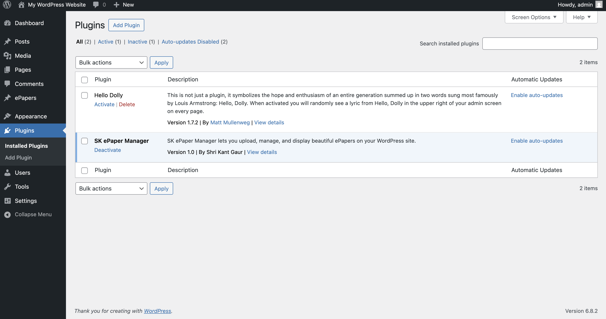
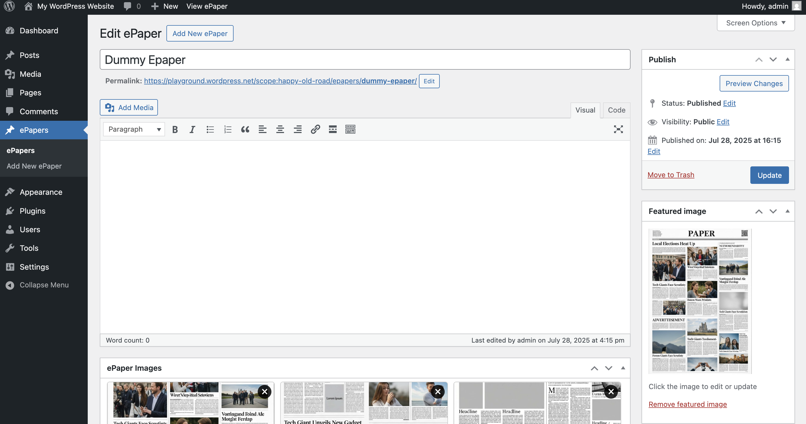
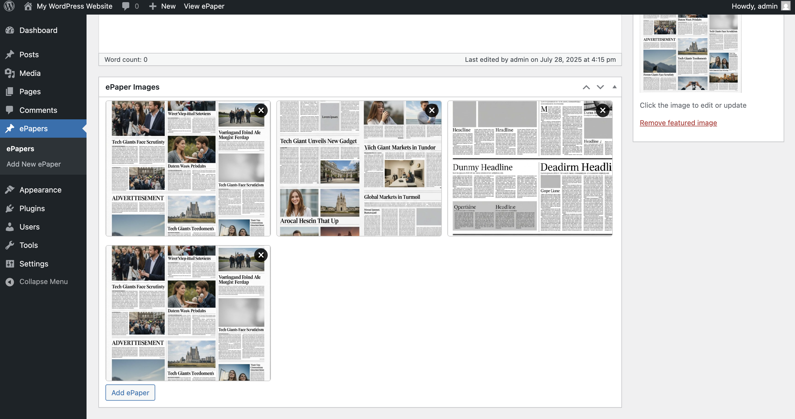
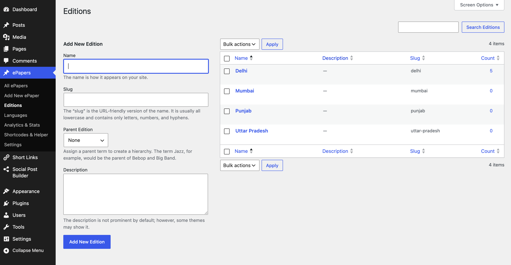
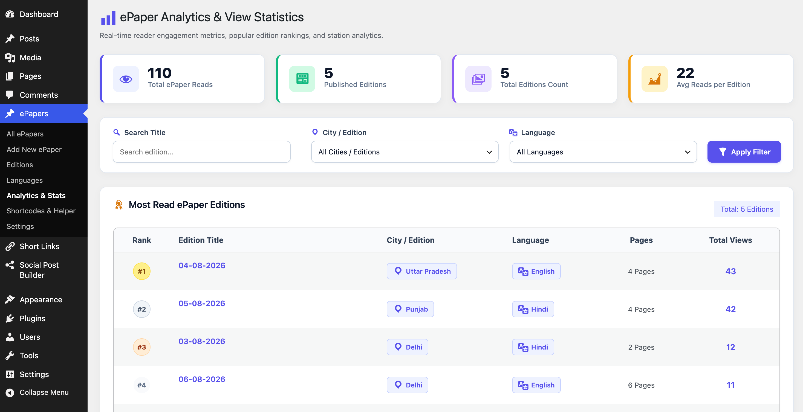
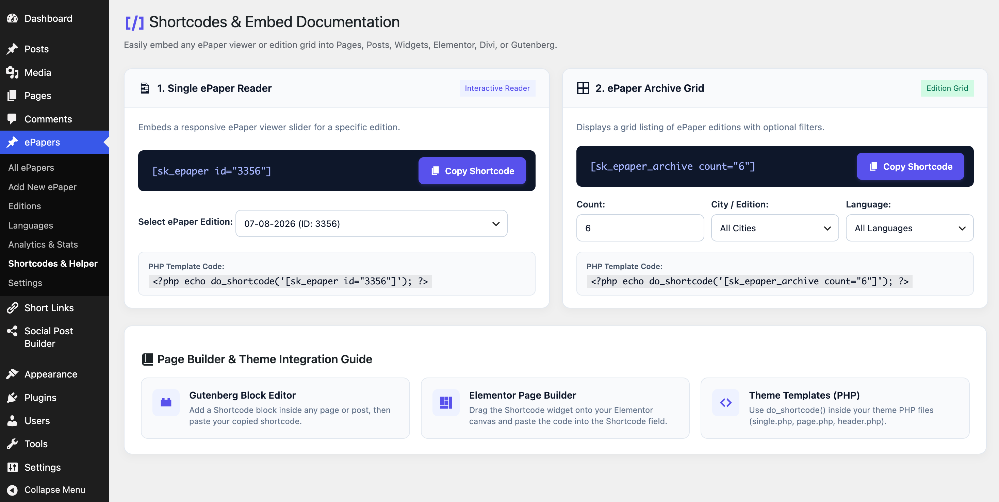
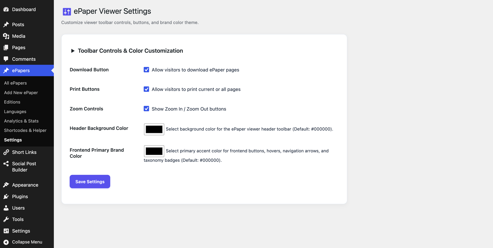

# SK ePaper Manager

[](https://wordpress.org/plugins/sk-epaper-manager/)
[](https://github.com/shrikantgaur/sk-epaper-manager)
[](https://wordpress.org/plugins/sk-epaper-manager/)
[](https://www.gnu.org/licenses/gpl-2.0.html)
[](https://www.gnu.org/licenses/gpl-2.0.html)

**SK ePaper Manager** is a feature-rich, high-performance WordPress plugin that lets you upload, manage, and display digital newspapers, magazines, brochures, or newsletters using **images or PDF files**.

Designed with modern aesthetics, fast AJAX reader engagement analytics, multi-city/language taxonomy management, shortcode builder, and custom brand color themes.

---

## 🚀 Key Features

* 📰 **Custom Post Type (`epaper`):** Dedicated admin management for digital editions.
* ↕️ **Drag-and-Drop Page Sorting:** Reorder pages intuitively in Admin metabox using jQuery UI Sortable.
* 🏙️ **City / Regional Editions & Languages Taxonomies:** Categorize newspapers by city (`epaper_edition`) and language (`epaper_language`).
* 📅 **Publication Date Picker:** Set custom edition publication dates.
* 📊 **AJAX Real-time Analytics Dashboard:** Track total views, published editions, average reads per edition, live search, and paginated rankings without page reloads.
* 🎨 **Brand Color & Viewer Settings:** Customize viewer toolbar controls (Zoom, Print, Download) and frontend primary brand color accent from WP Admin.
* 🧩 **Shortcode Embed Builder:** Embed single readers (`[sk_epaper id="123"]`) or edition grids (`[sk_epaper_archive count="6"]`) into Gutenberg, Elementor, Divi, or theme templates.
* 📑 **PDF & Image Support:** Upload JPG, PNG, WEBP, GIF, or PDF files.
* 🔍 **Interactive Single Reader:** Smooth page slider with Zoom In/Out, Print, and Download functionality.
* ⚡ **WordPress Coding Standards (WPCS 100% Compliant):** Fully sanitized inputs, nonce verification, and escaped output.

---

## 📸 Screenshots Showcase (Original & New Features)

### 🖥️ Original Classic Screenshots
| 1. Admin Installed & Active | 2. Add/Edit ePaper Drag & Drop Order |
| :---: | :---: |
|  |  |

| 3. Taxonomy Management | 4. Single ePaper Reader |
| :---: | :---: |
|  |  |

| 5. ePapers Archive Grid | |
| :---: | :---: |
|  | |

---

### ⚙️ New Feature Screenshots (v1.2.0)
| 6. Add New ePaper (Updated Upload & Date Picker) | 7. City & Regional Editions Taxonomy |
| :---: | :---: |
|  |  |

| 8. Languages Taxonomy | 9. AJAX Analytics & View Statistics |
| :---: | :---: |
|  |  |

| 10. Shortcodes & Embed Documentation | 11. Viewer Settings & Color Customization |
| :---: | :---: |
|  |  |

---

## 🛠️ Installation

1. Upload `sk-epaper-manager` folder to the `/wp-content/plugins/` directory, or install directly via WordPress Admin (**Plugins > Add New**).
2. Activate **SK ePaper Manager**.
3. Access the new **ePapers** menu in your WordPress Admin sidebar.

---

## 🧩 Shortcodes Usage

### 1. Single ePaper Reader
Embeds an interactive ePaper reader for a specific edition:
```shortcode
[sk_epaper id="123"]
```

**PHP Template Code:**
```php
<?php echo do_shortcode( '[sk_epaper id="123"]' ); ?>
```

### 2. ePaper Archive Grid
Displays a responsive grid listing of editions with optional count, city edition, or language filters:
```shortcode
[sk_epaper_archive count="6" edition="chandigarh" language="english"]
```

**PHP Template Code:**
```php
<?php echo do_shortcode( '[sk_epaper_archive count="6" edition="chandigarh"]' ); ?>
```

---

## 🧑‍💻 Developer Customization

Template files can be overridden by copying them from the plugin's `templates` folder into your active theme root:

- `archive-epaper.php` - Custom layout for archive listings (`/epapers/`).
- `single-epaper.php` - Custom layout for single edition reader pages.

---

## 📝 Changelog

### 1.2.0
* **New:** Added Drag-and-Drop page reordering in Admin metabox via jQuery UI Sortable.
* **New:** Added "Editions" (`epaper_edition`) and "Languages" (`epaper_language`) taxonomies.
* **New:** Added custom Publication Date picker field.
* **New:** Added Real-time AJAX Analytics Dashboard with view stats, live search, loading overlay, and pagination.
* **New:** Added Shortcode Embed Documentation page with interactive shortcode generator.
* **New:** Added ePaper Viewer Settings page with control toggles and primary brand color picker.
* **Security & Quality:** 100% WordPress Plugin Check (PCP / WPCS) compliance across all plugin files.

### 1.1.6
* Fixed PDF upload visibility in admin edit screen metabox.
* Fixed frontend JavaScript error when displaying PDF attachments in ePaper viewer.

### 1.1.5
* Added direct file access protection check in template files for enhanced security.
* Updated WordPress version compatibility check ("Tested up to: 7.0").
* Updated PHP requirement to 7.4.

---

## 📄 License

This plugin is open-source software licensed under the [GPLv2 or later](https://www.gnu.org/licenses/gpl-2.0.html).
