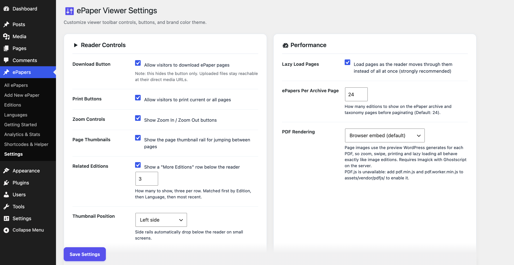

# SK ePaper Manager

[](https://wordpress.org/plugins/sk-epaper-manager/)
[](https://github.com/shrikantgaur/sk-epaper-manager)
[](https://wordpress.org/plugins/sk-epaper-manager/)
[](https://www.php.net/)
[](https://www.gnu.org/licenses/gpl-2.0.html)

Publish a digital newspaper, magazine or newsletter on WordPress. Upload each
day's pages as images or PDFs and readers get a proper ePaper reader: page rail,
zoom, print, download, keyboard and swipe navigation, and an archive they can
filter by edition, language and date.

---

## 🎬 Live Demo

Try it in your browser - no install, no signup. It opens a throwaway WordPress
site with sample editions already loaded.

**[▶ Open the live demo](https://playground.wordpress.net/?blueprint-url=https://raw.githubusercontent.com/shrikantgaur/sk-epaper-manager/main/blueprints/blueprint-standalone.json)**

The demo lands on the ePaper archive. Use the filters, open an edition to try the
reader, and look through the admin screens under **ePapers**. Nothing you do
affects anything - the site disappears when you close the tab.

The same demo is behind the **Live Preview** button on the
[WordPress.org plugin page](https://wordpress.org/plugins/sk-epaper-manager/).

---

## 🚀 Features

### For readers
* **Page reader** with zoom, print (single page or all), download, keyboard arrows and touch swipe.
* **Page rail** of thumbnails - below the reader or as a side rail - with optional section names like Front Page, City, Sports.
* **Pages load on demand.** A 24 page edition no longer pushes every full size image on first paint.
* **Archive filters:** search, Edition, Language, month and an exact edition date. The date picker only offers days that actually have an edition.
* **Related editions** under each reader, matched by Edition, then Language, then recency.
* **Accessible:** real buttons with labels, keyboard focus, a live region for the page counter, and reduced-motion support.

### For publishers
* **Custom post type** for editions, with **Editions** (city/regional) and **Languages** taxonomies.
* **Drag and drop** page ordering, a publication date, and a label per page.
* **Images or PDFs.** With Imagick and Ghostscript available, PDF pages can render as page images so zoom, print and lazy loading behave exactly like image editions.
* **Analytics** with reader engagement, top editions, live filtering and an edition date range.
* **Getting Started screen** with a step-by-step guide and one-click sample content.
* **Blocks and shortcodes** - `sk/epaper-viewer` and `sk/epaper-archive`, or the original shortcodes.

### Under the hood
* View counting runs through a REST beacon, so it **keeps working behind full page caching**. Repeat views from one visitor collapse over 24 hours and known bots are ignored.
* **Batched, resumable migrations**, so sites with thousands of editions upgrade without timing out.
* **Theme-overridable templates**, a configurable content width, and filters for developers.
* `uninstall.php` that **deletes nothing unless you opt in first**.

---

## 📸 Screenshots

| Add or edit an edition | Pages, order and labels |
| :---: | :---: |
|  |  |

| Archive with filters | The reader |
| :---: | :---: |
|  |  |

| Turning pages | A full edition page |
| :---: | :---: |
|  |  |

| Editions taxonomy | Languages taxonomy |
| :---: | :---: |
|  |  |

| Getting Started | Analytics |
| :---: | :---: |
|  |  |

| Shortcodes & Helper | Settings |
| :---: | :---: |
|  |  |

---

## 🛠️ Installation

1. **Plugins → Add New**, search for *SK ePaper Manager*, install and activate.
   Or upload the `sk-epaper-manager` folder to `/wp-content/plugins/`.
2. Open **ePapers → Getting Started**. It walks through publishing your first
   edition, and can import sample content if you want to look around first.

**Requires:** WordPress 5.0+, PHP 7.4+.
For PDF page previews, the server needs Imagick with Ghostscript.

---

## 🧩 Shortcodes

### Single reader
```
[sk_epaper id="123"]
```

### Archive grid
```
[sk_epaper_archive count="6" edition="city-edition" language="english"]
```

| Attribute | Default | Notes |
| --- | --- | --- |
| `count` | `6` | How many editions to show |
| `edition` | – | Edition term slug |
| `language` | – | Language term slug |

In a PHP template:
```php
<?php echo do_shortcode( '[sk_epaper id="123"]' ); ?>
```

In the block editor, search for **ePaper** to insert the same thing as a block.

---

## 🧑‍💻 For developers

### Template overrides
Copy a template into your theme - the plugin looks there first:

```
yourtheme/sk-epaper/single-epaper.php
yourtheme/sk-epaper/archive-epaper.php
```

### Filters

| Filter | Purpose |
| --- | --- |
| `sk_epaper_content_max_width` | Width of the reader and archive, in pixels. `0` removes the limit. |
| `sk_epaper_archive_per_page` | Editions per archive page. |
| `sk_epaper_related_editions` | The related editions shown under the reader. |
| `sk_epaper_should_count_view` | Whether the current request counts as a view. |
| `sk_epaper_enable_view_beacon` | Turn view counting off entirely. |
| `sk_epaper_force_load_assets` | Load the viewer assets on a page the content scan cannot see. |

### Data
Stored on each edition as post meta: `sk_epaper_images` (attachment IDs),
`sk_epaper_edition_date`, `sk_epaper_page_labels`, `sk_epaper_views`.

Every global function from 1.2.x still exists and is still hooked under the same
name, so existing `remove_action()` and `remove_filter()` calls keep working.

---

## ⬆️ Upgrading from 1.x

Editions, settings, permalinks and shortcodes are unchanged and upgrade
automatically. Two things change visibly:

* **View counts grow more slowly.** Bots and repeat visits no longer count.
  Historical totals are preserved.
* **The archive is paginated** at 24 editions per page. Adjust it under
  **ePapers → Settings**.

---

## 📝 Changelog

### 2.0.0
**Performance**
* Pages load on demand instead of all at once.
* Plugin CSS and JavaScript load only on pages that show an ePaper.
* The archive is paginated through the main query. It previously ran `posts_per_page = -1`, which could exhaust memory on sites with many editions.

**Reader**
* Added a page thumbnail rail, placeable below the reader or on either side.
* Added a related editions row under the reader.
* Added an optional PDF.js rendering mode, and a page-image mode for PDFs.
* Rebuilt navigation as real buttons with labels, focus states and a live page counter.

**Archive**
* Added search, Edition, Language, month and exact-date filters.
* Search now also matches taxonomy names and page labels.
* Taxonomy badges on a card link to their archive; the whole card is one link.

**Admin**
* Added a Getting Started screen and one-click sample content.
* Added per-page labels and an edition date range filter in Analytics.
* Analytics no longer drops editions that have never been viewed.
* Settings moved to the Settings API in a two column layout.

**Under the hood**
* Rebuilt around eight classes with a compatibility layer for every 1.2.x global.
* View counting moved to a REST beacon so it survives full page caching.
* Added batched, resumable migrations, `uninstall.php`, blocks, REST support and complete internationalisation.

### 1.2.0
* Drag-and-drop page reordering, Editions and Languages taxonomies, publication date picker, AJAX analytics dashboard, shortcode documentation and viewer settings.

### 1.1.6
* Fixed PDF upload visibility in the admin metabox and a frontend JavaScript error when displaying PDF attachments.

### 1.1.5
* Added direct file access protection in template files. Updated compatibility and PHP requirements.

Older entries are in [readme.txt](readme.txt).

---

## 📄 License

GPL v2 or later. See [LICENSE](https://www.gnu.org/licenses/gpl-2.0.html).
